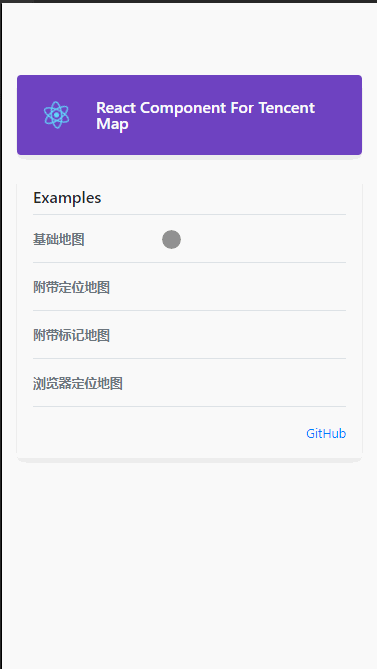

# Tencentmap_React
 Tencent map open source component writed by React&Javascript

 
#### A react component that simply encapsulates Tencent Web Map
 **GitHub source：[click](https://github.com/ThorinChen/Tencentmap_React-CSS)**


 **Demo source：[click](https://github.com/ThorinChen/Tencentmap_React-CSS/tree/master/examples/src/components/maps)**



 **Install**
```
yarn add react-qmap
or npm install react-qmap
```

 **Basic usage**

```
import ReactQMap from 'react-qmap';

<ReactQMap
    center={{latitude: 30.53786, longitude: 104.07265}}
    initialOptions={{zoomControl: true, mapTypeControl: true}}
    apiKey="xxxxxx-xxxxx-xxxxx-xxxxxx"
    style={{height: 300}}    //  Height and width account for 100% of the parent element by default  
/>
```

#### API
Method            | Type     | Optional | Default | Description
----------------- | -------- | -------- | --------| -----------
getMap   | function | false |  |  Get the map object and the map object of the current container. The first parameter is the current map object of new, and the second parameter is the global map object
style   | object| false |  |  Set the inline style of the component. The default style is width:'100%', height:'100%'
className   | string| false |  |  Set the class of the component
mySpot   | object| false |  |  Set the positioning coordinates of the map
initialOptions   | object| false | zoom: 14,disableDefaultUI: true, zoomControl: false,mapTypeControl: false, |  Initialize the parameters of the map. Several parameters are set by default
apiKey   | string| true |  |  Set the key referenced by the map to prevent API calls from being restricted
center   | object| true |  |  Set the center position coordinates of map initialization
getContainer   | function| false |  |  The function to obtain the HTML DOM element of the map. The parameter is the DOM element of the current map
libraries   | array| false |  |  Set the libraries Library of the map, and support the transfer of arrays to multiple libraries. For the usage of other specific libraries, please refer to the official website

#### Support for other frameworks and libraries


#### Example 
File：[https://github.com/ThorinChen/Tencentmap_React-CSS/blob/master/examples/src/components/maps/TaroQMap.js](https://github.com/ThorinChen/Tencentmap_React-CSS/blob/master/examples/src/components/maps/TaroQMap.js)
```js
// Copy files to the appropriate directory, such as the current file directory
import TaroQMap from './TaroQMap';

{process.env.TARO_ENV === 'h5' && (
    <View style={{ height: 500, width: 500 }}>
        <TaroQMap
            center={{latitude: 30.53786, longitude: 104.07265}}
            mySpot={{latitude: 30.53786, longitude: 104.07265}}
            apiKey="xxxxx"
        />
    </View>
)}
```
